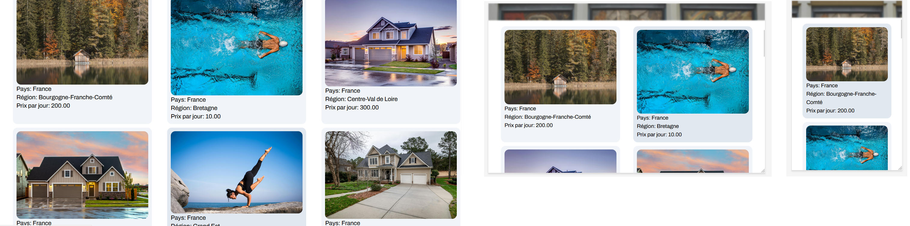

# WordSkills Travel

> WordSkills Travel est un site sur lequelle les utilisateurs peuvent réserver des séjours chez l'habitant ainsi que des expérience unique, tant à court quèà long terme, dans divers pays et régions.


## Langage 🖊
<a href="https://www.w3.org/html/" target="_blank" rel="noreferrer">  </a> 
<a href="https://www.w3schools.com/css/" target="_blank" rel="noreferrer">  </a> 
<a href="https://developer.mozilla.org/en-US/docs/Web/JavaScript" target="_blank" rel="noreferrer">  </a> 

## Technologie ⚙
<a href="https://nodejs.org" target="_blank" rel="noreferrer">  API</a> 
<a href="https://expressjs.com" target="_blank" rel="noreferrer">  </a> 
<a href="https://www.postgresql.org" target="_blank" rel="noreferrer">  </a> </p>

## Aperçu

### Accueil


### Navigation


### Réservation par mail


### Mail


### Responsive


## Sécurité
- Requête préparer contre injection SQL 💉
- Hashage de données personnel 🔑
- Gestion de session d'authentification 👩‍💻
- Communication par code http (200, 404, 500, ...) 📢
- Mot de passe enregistré dans un .env
- Création d'utilisateur avec le strict nécessaire en terme de privilèges

## Gestion des erreur


## MCD


## Information
> Se site web à été créer lors d'une compétition de la 48ème édition des olympiades des métiers en régional de la Nouvelle-Aquitaine.

## installation

```sql
CREATE TABLE public."T_TypeReservable"(
   "IdTypeReservable" SERIAL,
   "TypeReservable" VARCHAR(50)  NOT NULL,
   PRIMARY KEY("IdTypeReservable")
);

CREATE TABLE public."T_CompteUtilisateur"(
   "IdCompteUtilisateur" SERIAL,
   "Nom" VARCHAR(50)  NOT NULL,
   "Prenom" VARCHAR(50)  NOT NULL,
   "Mail" VARCHAR(256)  NOT NULL,
   "MotDePasse" VARCHAR(256)  NOT NULL,
   PRIMARY KEY("IdCompteUtilisateur")
);

CREATE TABLE public."T_Echange"(
   "IdEchange" SERIAL,
   Message VARCHAR(1000)  NOT NULL,
   "DateMessage" TIMESTAMP NOT NULL,
   "IdCompteUtilisateurProprietaire" INTEGER NOT NULL,
   "IdCompteUtilisateurDestinataire" INTEGER NOT NULL,
   PRIMARY KEY("IdEchange"),
   FOREIGN KEY("IdCompteUtilisateurProprietaire") REFERENCES public."T_CompteUtilisateur"("IdCompteUtilisateur"),
   FOREIGN KEY("IdCompteUtilisateurDestinataire") REFERENCES public."T_CompteUtilisateur"("IdCompteUtilisateur")
);

CREATE TABLE public."T_Reservable"(
   "IdReservable" SERIAL,
   "NomReservable" VARCHAR(50)  NOT NULL,
   "Prix" NUMERIC(15,2)   NOT NULL,
   "Pays" VARCHAR(50)  NOT NULL,
   "Region" VARCHAR(50)  NOT NULL,
   "Ville" VARCHAR(50)  NOT NULL,
   "Adresse" VARCHAR(256)  NOT NULL,
   "IdCompteUtilisateurProprietaire" INTEGER NOT NULL,
   PRIMARY KEY("IdReservable"),
   FOREIGN KEY("IdCompteUtilisateur") REFERENCES public."T_CompteUtilisateur"("IdCompteUtilisateur")
);

CREATE TABLE public."T_Reservation"(
   "IdReservation" SERIAL,
   "DateDebutReservation" DATE NOT NULL,
   "DateFinReservation" DATE NOT NULL,
   "IdCompteUtilisateur" INTEGER NOT NULL,
   "IdReservable" INTEGER NOT NULL,
   "LienImage" VARCHAR(256) NOT NULL,
   PRIMARY KEY("IdReservation"),
   FOREIGN KEY("IdCompteUtilisateur") REFERENCES "T_CompteUtilisateur"("IdCompteUtilisateur"),
   FOREIGN KEY("IdReservable") REFERENCES public."T_Reservable"("IdReservable")
);


CREATE TABLE public."T_AssoReservableType"(
   "IdReservable" INTEGER,
   "IdTypeReservable" INTEGER,
   PRIMARY KEY("IdReservable", "IdTypeReservable"),
   FOREIGN KEY("IdReservable") REFERENCES public."T_Reservable"("IdReservable"),
   FOREIGN KEY("IdTypeReservable") REFERENCES public."T_TypeReservable"("IdTypeReservable")
);
```

```nodejs
npm install

node .\server\server.js
```

allez sur le navigateur de votre choix: http://127.0.0.1:8080/web/index.html