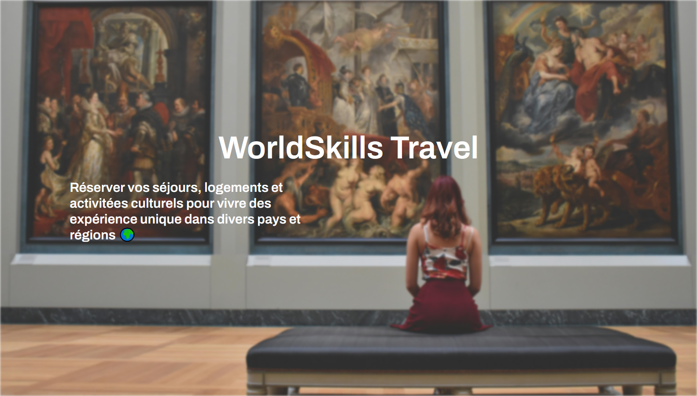
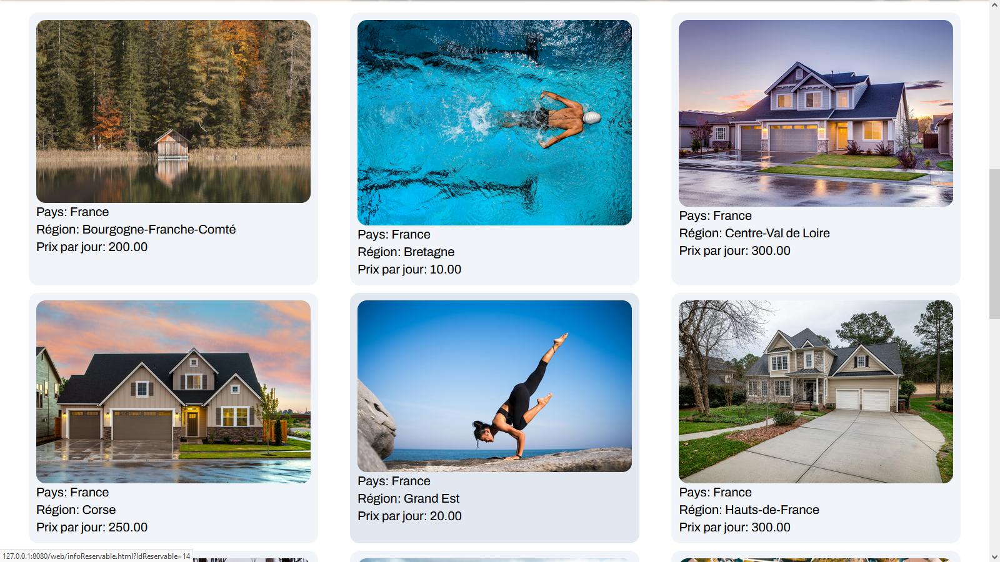
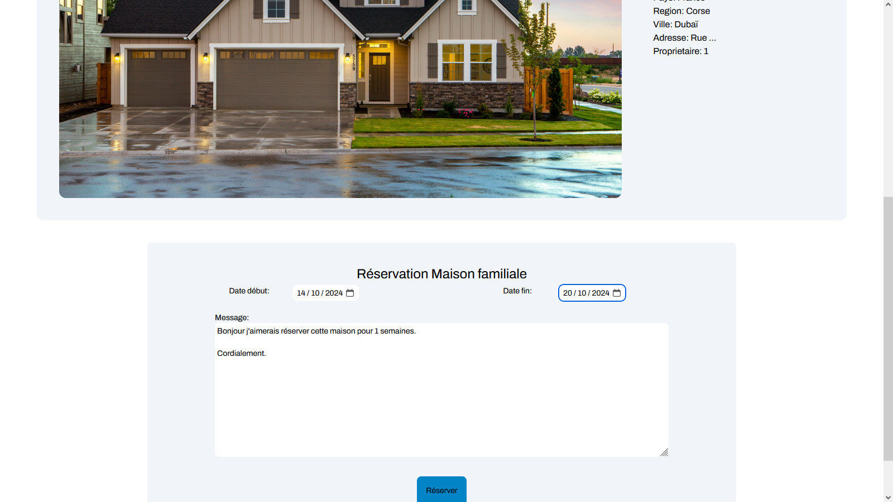
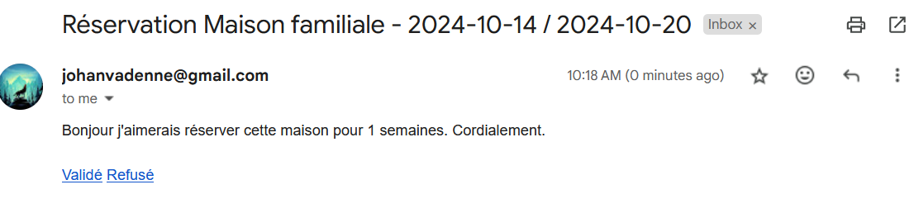
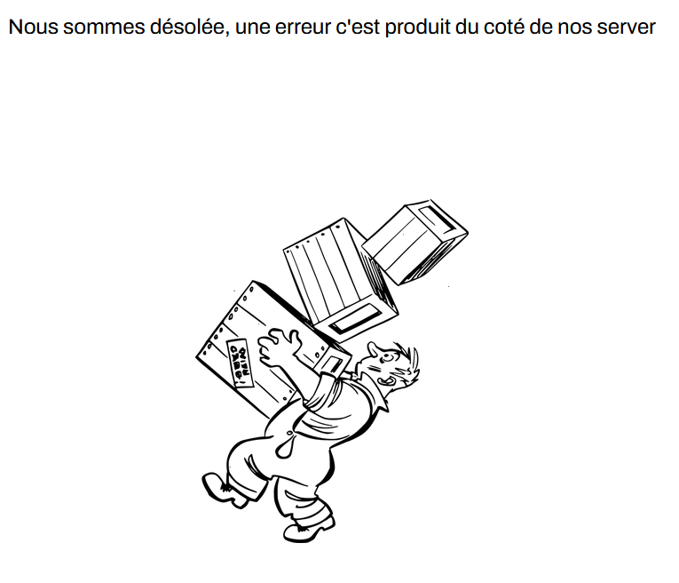
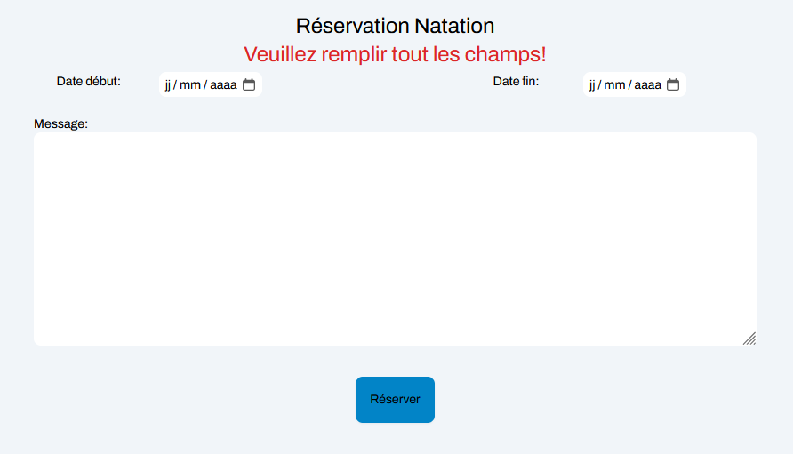
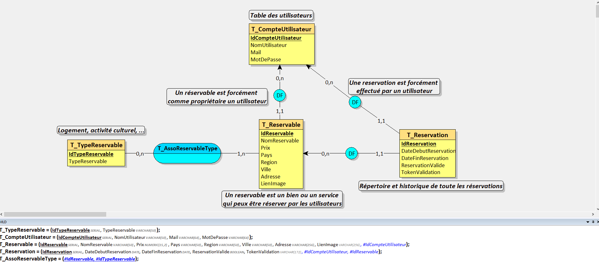

# WordSkills Travel

> WordSkills Travel est un site sur lequelle les utilisateurs peuvent réserver des séjours chez l'habitant ainsi que des expérience unique, tant à court quèà long terme, dans divers pays et régions.

## Langage 🖊
 
 
 

## Technologie ⚙
<a href="https://nodejs.org" target="_blank" rel="noreferrer">  API</a> 
 
 

## Aperçu

### Accueil

### Navigation

### Réservation par mail

### Mail

## Sécurité
- Requête préparer contre injection SQL 💉
- Hashage de données personnel 🔑
- Gestion de session d'authentification 👩‍💻
- Communication par code http (200, 404, 500, ...) 📢
- Mot de passe enregistré dans un .env
- Création d'utilisateur avec le strict nécessaire en terme de privilèges

## Gestion des erreur

## MCD

## Information
> Se site web à été créer lors d'une compétition de la 48ème édition des olympiades des métiers en régional de la Nouvelle-Aquitaine.